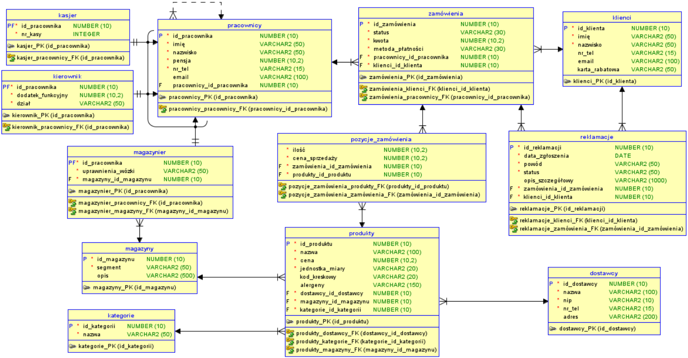
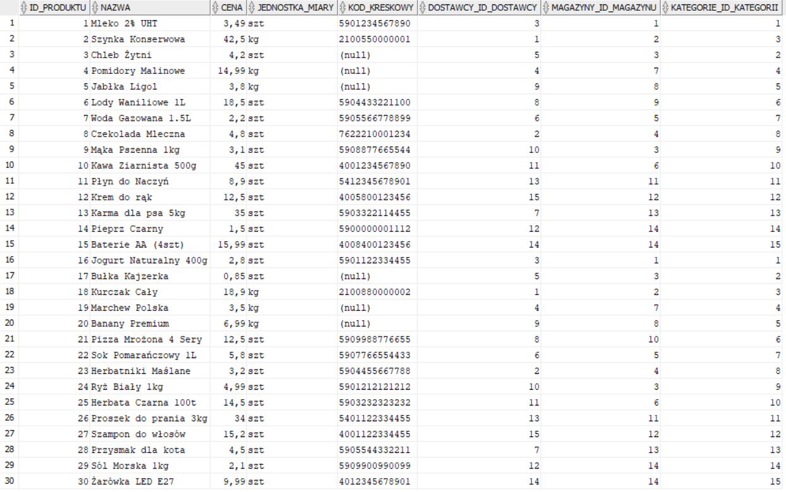
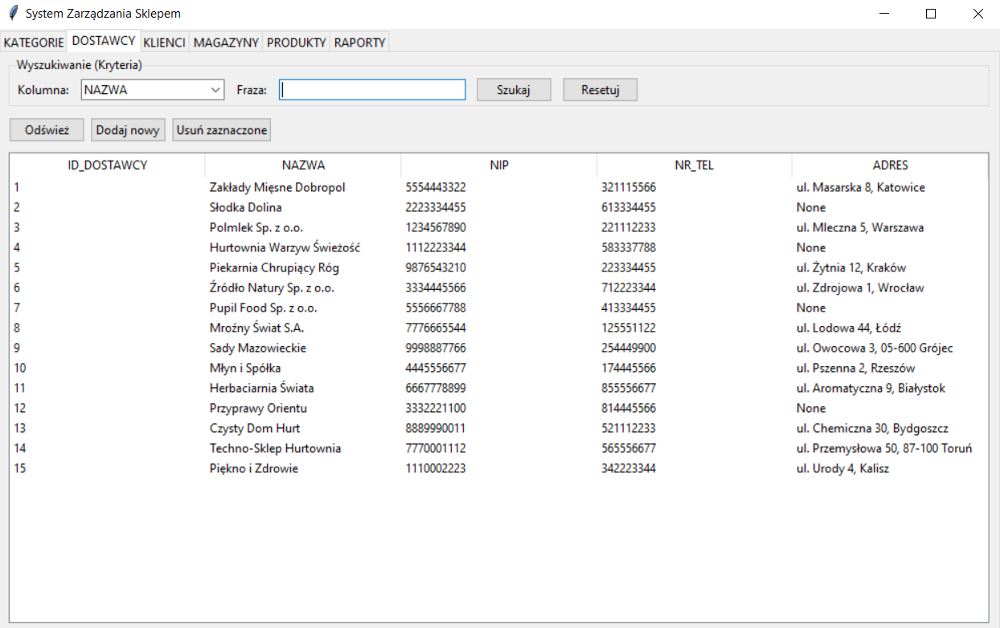
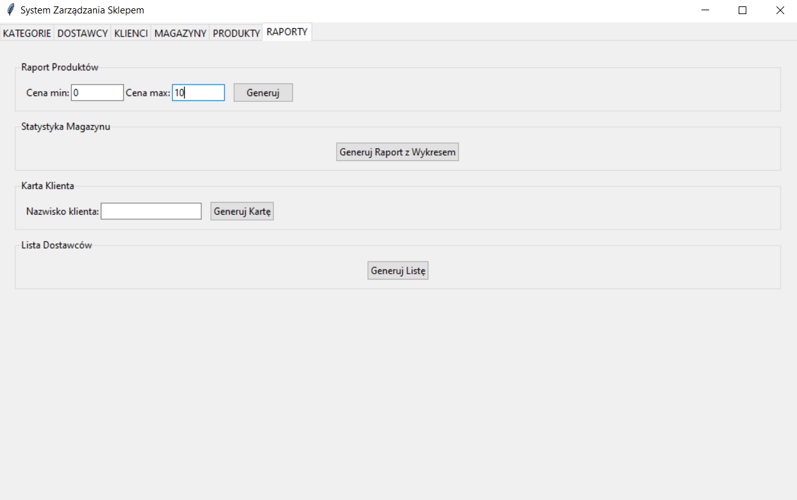

# Grocery Store Management System

> *Note: This repository contains an academic project. The source code, comments, and full PDF documentation are written in Polish to strictly meet the university course requirements.*

System for grocery store that integrates a relational database with a custom-built desktop application. The application allows users to manage store data such as products, employees, and orders, while also providing tools for generating reports.


## Project Preview

### Database Architecture

The diagram below presents the initial conceptual relational model. During the physical database implementation in Oracle SQL, the schema was further normalized. To adhere to the First Normal Form (1NF), the multi-valued alergeny attribute was extracted from the `PRODUKTY` table into a dedicated associative table `PRODUKTY_ALERGENY`. This allows for a clean One-to-Many relationship and ensures better data integrity.



### Database Contents

The database is fully populated with sample data to simulate a real-world store environment. Below is a raw view of the `PRODUKTY` table directly from the Oracle database.



### App Interface

Here is how the application interface looks in practice. The uncomplicated GUI provides an intuitive way to interact with the underlying Oracle database without writing SQL. 



The application also provides report generation. Below you can see a view of the raports tab.




## Main Features

This project shows how to connect an Oracle database with a Python application. The most important features are:

* **Database Design:** A well-structured relational database with 13 tables to store information about products, employees, and customers.
* **Data Management (CRUD):** You can easily add, view, edit, and delete records using the application interface, without writing any SQL code.
* **PDF Reports & Charts:** The application can generate PDF documents (like customer cards or supplier lists) and draw warehouse statistics charts using the `matplotlib` library.
* **Safe Data Saving:** The Python code uses database transactions (`commit` and `rollback`) to make sure all data is saved safely and without errors.


## Code Examples

### Stored Procedure with Custom Exception Handling

The `przyznaj_premie` procedure handles employee bonus allocations. It features explicit exception handling, including a custom exception (`e_premia_za_wysoka`) that prevents assigning a bonus higher than the employee's base salary, as well as handling standard errors like `NO_DATA_FOUND`.

```sql
CREATE OR REPLACE PROCEDURE przyznaj_premie (p_id_prac NUMBER, p_premia NUMBER) AS
    v_pensja NUMBER;
    e_premia_za_wysoka EXCEPTION;
BEGIN
    SELECT pensja INTO v_pensja FROM pracownicy WHERE id_pracownika = p_id_prac;
    
    IF p_premia > v_pensja THEN
        RAISE e_premia_za_wysoka;
    END IF;
    
    DBMS_OUTPUT.PUT_LINE('Pracownik ID ' || p_id_prac || ' otrzymał premię: ' || p_premia);
EXCEPTION
    WHEN NO_DATA_FOUND THEN
        DBMS_OUTPUT.PUT_LINE('BŁĄD: Nie ma pracownika o ID ' || p_id_prac);
    WHEN e_premia_za_wysoka THEN
        DBMS_OUTPUT.PUT_LINE('BŁĄD: Premia (' || p_premia || ') nie może być wyższa niż pensja!');
    WHEN OTHERS THEN
        DBMS_OUTPUT.PUT_LINE('Wystąpił nieoczekiwany błąd.');
END;
```

### Business Logic Trigger (Salary Validation)

The `trg_limit_podwyzki` trigger protects the financial stability of the store. It activates before any update to the salary column, calculating the difference between the `:NEW` and `:OLD` salary values. If a single raise exceeds the allowed limit (1000 PLN), it blocks the transaction and raises a custom application error.

```sql
CREATE OR REPLACE TRIGGER trg_limit_podwyzki
BEFORE UPDATE OF pensja ON pracownicy
FOR EACH ROW
BEGIN
    IF :NEW.pensja - :OLD.pensja > 1000 THEN
        RAISE_APPLICATION_ERROR(-20006, 'BŁĄD: Jednorazowa podwyżka nie może przekraczać 1000 zł!');
    END IF;
END;
```

### Python: Transaction Management & Relational Inserts

The application ensures data integrity during complex insert operations by using database transactions. If any step fails (e.g., inserting a product or its related allergens), the `rollback()` method is called to prevent partial data from being saved.

```python
def insert_product(data, alergens_str):
    """
    Realizuje operację wstawiania produktu oraz powiązanych z nim alergenów.
    Zapewnia integralność operacji poprzez wykorzystanie mechanizmu transakcji (commit/rollback).
    """
    conn = get_connection()
    cursor = conn.cursor()
    try:
        # Wstawienie danych do tabeli PRODUKTY z wykorzystaniem klauzuli RETURNING dla klucza głównego
        sql_prod = """
                   INSERT INTO PRODUKTY (NAZWA, CENA, JEDNOSTKA_MIARY, 
                                         KOD_KRESKOWY,
                                         DOSTAWCY_ID_DOSTAWCY, 
                                         MAGAZYNY_ID_MAGAZYNU, 
                                         KATEGORIE_ID_KATEGORII)
                   VALUES (:1, :2, :3, :4, :5, :6, :7) 
                   RETURNING ID_PRODUKTU INTO :8
                   """
        new_id_var = cursor.var(int)

        # Obsługa opcjonalności atrybutu KOD_KRESKOWY
        kod = data['KOD_KRESKOWY'] if data['KOD_KRESKOWY'].strip() else None

        cursor.execute(sql_prod, [
            data['NAZWA'], data['CENA'], data['JEDNOSTKA_MIARY'], kod,
            data['DOSTAWCA_ID'], data['MAGAZYN_ID'], data['KATEGORIA_ID'],
            new_id_var
        ])
        new_id = new_id_var.getvalue()[0]

        # Iteracyjne wstawianie rekordów do tabeli asocjacyjnej PRODUKTY_ALERGENY
        if alergens_str.strip():
            alergeny = [a.strip() for a in alergens_str.split(",")]
            for alergen in alergeny:
                cursor.execute(
                    "INSERT INTO PRODUKTY_ALERGENY (NAZWA_ALERGENU, ID_PRODUKTU) VALUES (:1, :2)",
                    [alergen, new_id]
                )

        conn.commit()
        return True
    except Exception as e:
        # Wycofanie wszystkich zmian w przypadku wystąpienia błędu podczas zapisu
        conn.rollback()
        print(f"Błąd operacji INSERT: {e}")
        return False
    finally:
        cursor.close()
        conn.close()
```


## Technologies & Tools

* **Database:** Oracle Database XE, SQL, PL/SQL
* **Application (GUI & Backend):** Python, Tkinter, `oracledb`
* **Data Visualization & PDF:** `matplotlib`, `fpdf`
* **Development & Modeling:** Oracle SQL Developer, Data Modeler, Draw.io


## Project Structure

* `main_gui.py`: Main entry point for the desktop application.
* `db_operations.py`: Handles secure communication with the Oracle database.
* `report_manager.py`: Logic for generating PDF reports and charts.
* `Sklep_DDL_DML_Full.sql`: SQL script to set up tables and insert initial data.


## Author
* **Antoni Jackowski**
